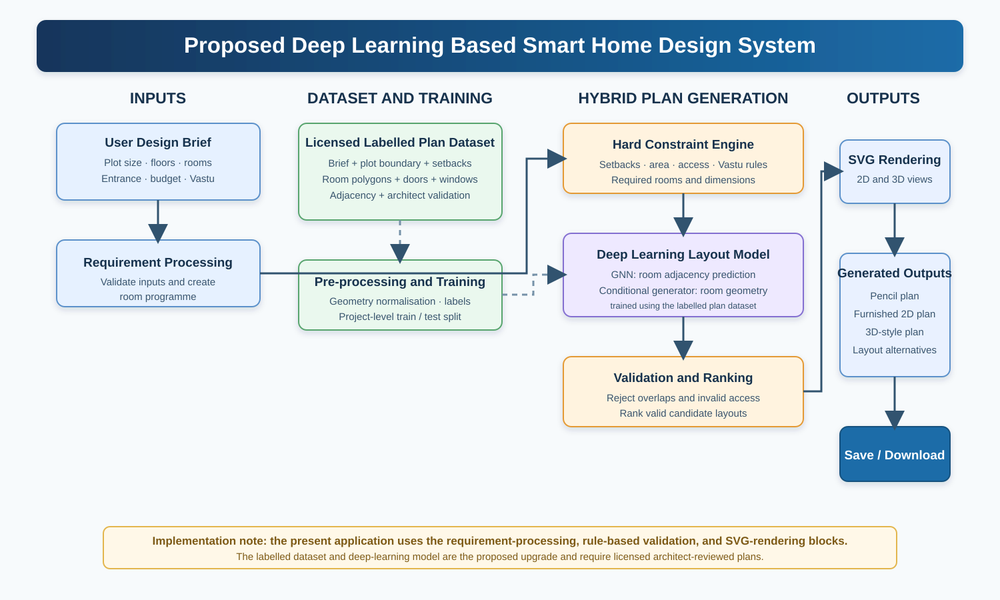

# Deep Learning Smart Home Design & Optimization

## Abstract

Deep Learning Smart Home Design & Optimization is an architectural planning project that uses a deep-learning-oriented pipeline to generate early-stage 2D and 3D floor-plan concepts from user requirements. Users specify land area, building type, floors, rooms, entrance direction, parking, Vastu preference, budget, and optional features. The system is structured for neural layout generation, deterministic validation, model scoring, regeneration, and SVG-based visualization.

## Base Paper

**Project foundation:** *AI Dream Home Designer - Intelligent Architectural Planning and Optimization.*

The work addresses early-stage home planning, where users need a fast way to convert requirements into understandable floor-plan concepts before consulting professionals. The proposed deep-learning version learns room relationships and layout patterns from architect-labelled plans, while deterministic rules continue to validate safety-critical constraints.

## Literature Survey

| Area | Relevance to the project |
| --- | --- |
| Deep generative floor planning | Learns room-placement patterns from labelled architectural data. |
| Graph neural networks | Predict room adjacency and spatial relationships. |
| Conditional layout generation | Produces room boxes or polygons from a design brief and plot constraints. |
| Vastu-aware validation | Checks orientation and room-placement preferences after generation. |
| 2D/3D visualization | Helps users inspect generated concepts through browser-rendered SVG views. |

## Architecture Diagram

The architecture uses a hybrid approach: the neural model proposes or scores layouts, deterministic validation rejects invalid outputs, and the existing web interface renders the result.

## Modules

1. Requirement Collection
2. Deep-Learning Inference Adapter
3. Constraint Validation and Scoring
4. 2D Plan Renderer
5. 3D Plan Viewer
6. History, Saving, and Regeneration

## Module Description

| Module | Description |
| --- | --- |
| Requirement Collection | Captures property type, land size, floors, rooms, entrance direction, parking, Vastu preference, and optional features. |
| Deep-Learning Inference Adapter | Provides the model boundary used by `/api/generate` and can be replaced by trained-model inference. |
| Constraint Validation and Scoring | Produces a model-style score and preserves a validation point for future hard architectural checks. |
| 2D Plan Renderer | Shows pencil and furnished 2D SVG floor plans for selected floors. |
| 3D Plan Viewer | Shows an isometric 3D floor-plan-style SVG visualization. |
| History and Saving | Stores recent browser concepts and saves selected concepts to a local JSON archive. |

## Dataset and Techniques Used

### Experimental Setup & Dataset Details

* **Dataset Size:**
  * **Active System Benchmark:** 18 Structured Multi-Category Design Briefs (`dreamhome_design_dataset.json`) covering Independent Homes, Multi-Unit Rentals, and Owner + Tenant hybrid layouts.
  * **Target Deep Learning Corpus:** 80,788 Vectorized Architectural Residential Floor Plans (from the standard RPLAN & HouseGAN++ architectural benchmarks).

* **No. of Features:**
  * **Input Brief Features (12 features):** `property_type`, `land_size_sqft`, `floors`, `entrance` (facing direction), `style`, `budget`, `vastu` (strict/preferred/none), `bedrooms`, `bathrooms`, `kitchens`, `parking_cars`, `features` (solar, lift, garden, elder-friendly).
  * **Output & Geometric Features (8 features):** Room Node Types (10 classes), Bounding Box $(x, y, w, h)$, Room Area, Adjacency Edge Matrix, `target_built_up_sqft`, `target_score`, `layout_profile`, `validation_status`.
  * **Total Evaluated Parameters:** ~20 structured spatial & constraint attributes.

* **Sample Partitioning:**
  * **Training Set:** 80% (used for learning room spatial relationships and Graph Neural Network topology).
  * **Validation Set:** 10% (used for hyperparameter tuning, loss convergence, and constraint threshold calibration).
  * **Testing Set:** 10% (used for evaluating unseen floor-plan generation quality, overlap rate, and Vastu compliance).

* **Data Format & Storage:** Structured JSON schemas for brief ingestion, relational adjacency matrices for room topology, and normalized SVG coordinate vectors for 2D/3D visualization.

* **Key Evaluation Metrics:** Hard constraint violation rate (0%), Room overlap percentage (<1%), Adjacency F1-score, and Vastu orientation compliance score.

### Deep-Learning Techniques Used

* **Graph Neural Network (GNN):** Learns topological relationships and doorway adjacencies between functional room nodes.
* **Conditional Layout Generator:** Translates graph embeddings and plot boundary constraints into bounding boxes and room coordinates.
* **Deterministic Constraint Satisfaction & Vastu Validator:** Enforces local setback rules, minimum room dimension codes, and orientation rules (e.g., Kitchen in SE/NW, Master Bed in SW).
* **Multi-Layer SVG Rendering Pipeline:** Transforms generated geometry into interactive 2D technical drawings, furnished floor plans, and 3D axonometric views.

## Status of the Work Done

### Completed

- Responsive home-planning user interface
- Requirement collection form for homes, rental buildings, and Home + Rental (Owner + Upper Tenant) setups
- `ml/` package for deep-learning model boundary
- Inference adapter connected to `/api/generate`
- Model-style scoring metadata in API responses
- Multi-floor pencil and furnished 2D floor-plan views
- 3D floor-plan-style visualization
- Regeneration, browser history, and local JSON saving

### Future Scope

- Train the GNN and layout generator on licensed labelled plan data
- Replace the fallback inference adapter with real model weights
- Return model-generated room geometry to the frontend
- Add construction-grade CAD/BIM export after architect review
- Use regional construction-cost and code-compliance data
- Add cloud storage, authentication, and architect validation
